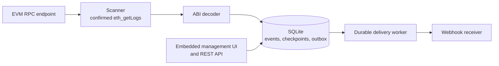
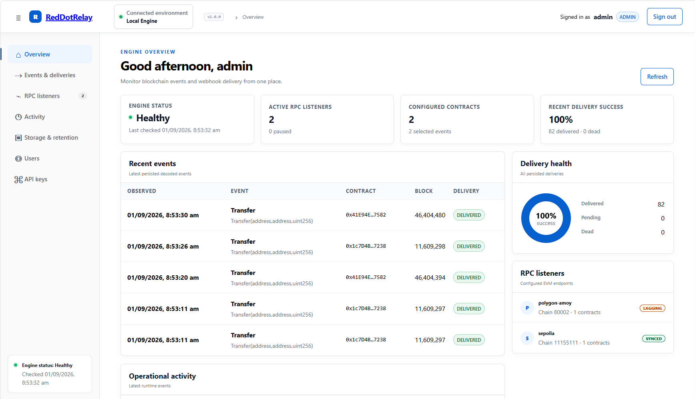
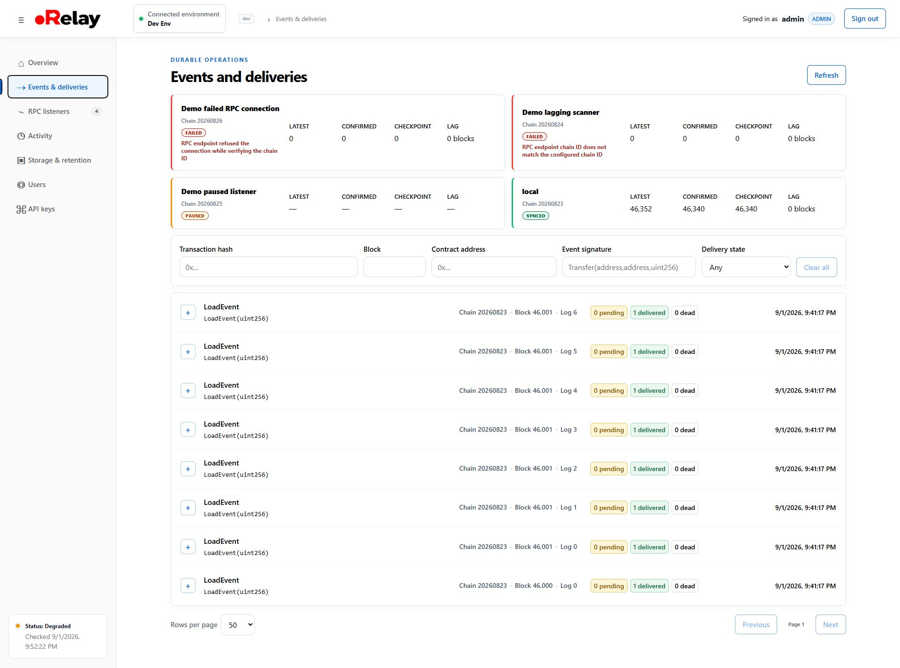
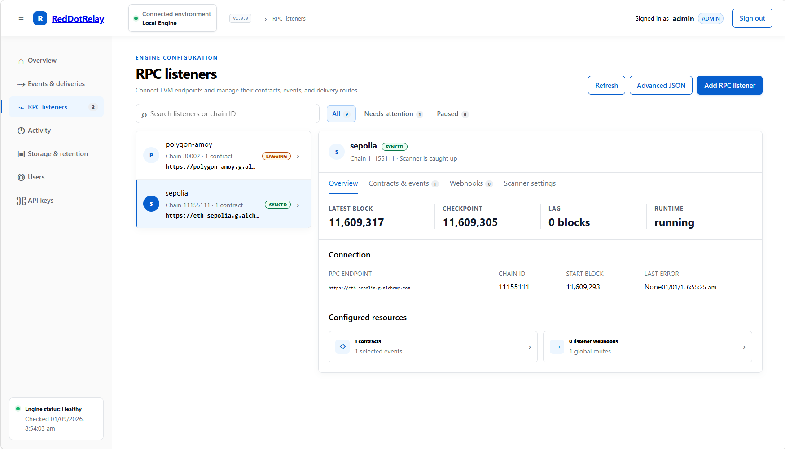

# RedDotRelay

RedDotRelay is a secure, self-hosted EVM event-to-webhook relay. It scans confirmed chain logs, decodes ABI events, stores state in SQLite, and delivers webhooks with durable retries in one process and one container.

RedDotRelay is open source under [AGPL-3.0-only](LICENSE). See [third-party notices](THIRD_PARTY_NOTICES.md), [security policy](SECURITY.md), and [support](SUPPORT.md).

## High Level Architecture



## Interface

### Engine overview



### Events and deliveries



### RPC listeners



## Quick start

```sh
docker compose up --build -d
```

Open <http://127.0.0.1:8080/ui/> and create the initial administrator.

To test the published Docker Hub image instead of building locally:

```powershell
docker pull shinlay/reddotrelay:latest
docker volume create reddotrelay-data
docker run --rm --name reddotrelay `
  -p 8080:8080 `
  -v reddotrelay-data:/var/lib/reddotrelay `
  shinlay/reddotrelay:latest
```

Check <http://127.0.0.1:8080/healthz>, then open
<http://127.0.0.1:8080/ui/> to create the initial administrator.

### Completely reset all data

> **Warning:** This permanently deletes every RedDotRelay user, RPC listener,
> contract, event, delivery, audit record, and setting stored in SQLite.

For the published Docker image quick start, remove the container and its named
data volume, then create a fresh volume:

```powershell
docker rm -f reddotrelay
docker volume rm reddotrelay-data
docker volume create reddotrelay-data
```

Start the image again using the `docker run` command above, then open the UI to
create a new initial administrator.

For a Docker Compose installation:

```powershell
docker compose down -v
docker compose up --build -d
```

For a local source build, install Go 1.27.1 and Node.js 24+, then run:

```powershell
Copy-Item config.example.yaml config.yaml
npm --prefix ui ci
npm --prefix ui run build
go run ./cmd/reddotrelay -config config.yaml
```

## Features

RedDotRelay combines reliable chain synchronization, durable webhook delivery,
and operational visibility in a single self-hosted Engine.

### Reliable chain monitoring

- **Confirmed scanning:** Follows confirmed EVM logs with durable checkpoints.
- **Reorg safety:** Validates canonical block and parent hashes before commit.
- **Complete history:** Preserves empty blocks and only advances checkpoints
  after durable persistence.

### Efficient synchronization

- **Batch verification:** Retrieves block headers through JSON-RPC batch
  requests for efficient synchronization.
- **Provider compatibility:** Falls back automatically to individual requests
  when batching is unavailable.
- **Shared RPC budget:** Applies `verification_concurrency` process-wide across
  live listeners and backfill jobs.

### Event delivery you can trust

- **Deterministic events:** Decodes ABI events into stable event IDs and stores
  them in SQLite.
- **Durable delivery:** Provides at-least-once delivery, retries, and dead
  letters.
- **Atomic outbox:** Creates event and delivery records together so temporary
  receiver failures do not lose events.

### Operations and visibility

- **Embedded administration:** Manages listeners, backfills, deliveries, and
  configuration through the UI or authenticated REST API.
- **Performance session:** Shows verification timing and scanner progress on
  the Overview page.
- **Clear listener state:** Distinguishes an active `Catching up` listener from
  a stalled or failed listener.

### Secure RPC configuration

- **Authentication options:** Supports HTTP Basic, static Bearer tokens,
  custom headers including API keys, Ethereum Engine JWT, and provider JWT
  token endpoints.
- **Local protection:** Encrypts credential values with the Engine operator
  key and keeps them write-only across the UI, API, exports, audits, metrics,
  and logs.

YAML contains static process settings. Listener, contract, webhook, user, API key, retention, and audit configuration is managed through the authenticated UI or API and stored in SQLite. Keep credential-bearing values in environment or file references; never commit secrets.

## API and operations

The service listens on port 8080. `/healthz`, `/readyz`, and `/metrics` expose health and telemetry. Management routes under `/api/v1/` require a UI session or API key.

Developers can use the [OpenAPI specification](api/openapi.yaml) as the
authoritative reference for endpoints, request payloads, response schemas, and
status codes. It also documents authentication requirements and ETag-based
configuration mutations.

Create an admin API key locally:

```powershell
go run ./cmd/reddotrelay api-key create -config config.yaml -name operations -role admin
```

Send it as `Authorization: Bearer <secret>`. Secrets are shown only once and stored as hashes.

## License and support

Modified network versions must provide corresponding source as required by the AGPL. Dependency licenses are included under `LICENSES/`.

Report security issues privately using [SECURITY.md](SECURITY.md). Use the repository GitHub issue tracker for bugs, questions, and feature requests.

## Development approach

RedDotRelay uses an AI-assisted engineering workflow. AI coding agents may assist
with implementation, testing, documentation, code review, and iterative
improvement.

AI-generated changes are treated as engineering contributions, not trusted
output: they are reviewed, tested, and validated before release. Project
maintainers remain responsible for architecture, security decisions, and the
released software.
